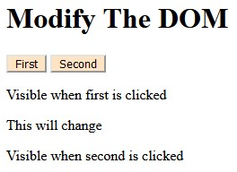

helloDOM
======
**helloDOM** is my introduction and future reference for javascript manipulating the Document Object Model.

#### Screenshot

## Usage
* Open up and folder and double click the HTML file to open it in your browser

### Contributors on GitHub
* [Ryan Thompson](https://www.linkedin.com/in/rthomp10/)

### Third party libraries
* see [LIBRARIES](https://github.com/username/sw-name/blob/master/LIBRARIES.md) files

## License 
* MIT
